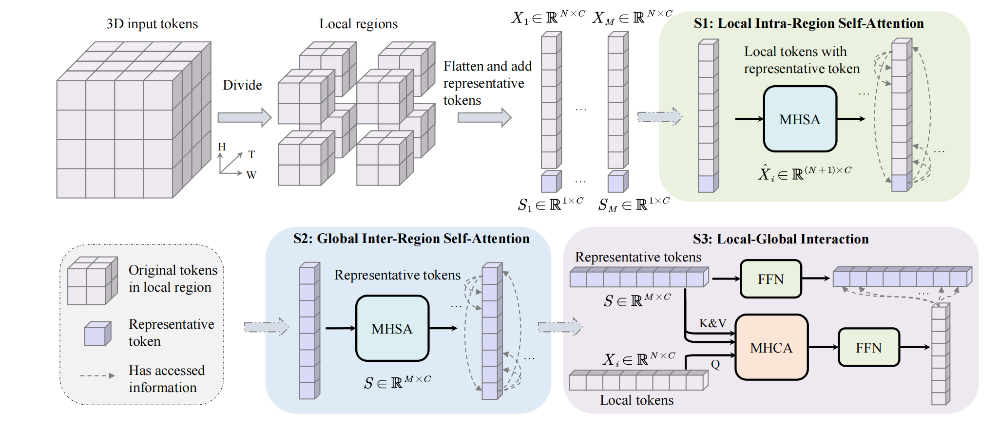

# Integrating VideoMAE based model and Optical Flow for Micro- and Macro-expression Spotting (ACM MM MEGC2023)


## ✨ Abstract

The task of interval localization of macro- and micro-expression in long videos has a wide range of applications in the field of human-computer interaction. Compared with macro-expression, micro-expression has shorter duration, lower intensity, and smaller number of samples, which make them more difficult to spot accurately in long videos. In this paper, we propose a pre-trained model combined with the optical flow method to improve the accuracy and robustness of macro- and micro-expression spotting. Firstly, self-supervised pre-training is performed on rich unlabeled data based on VideoMAE. Then, multiple models are trained on the datasets SAMM-LV and CAS(ME)³ for macro- and micro-expression with different fine-grains. Finally, different lengths of slices are generated based on the models with different fine-grains, and the optimal matching method through the combination of model fine-grainedness and slice lengths is explored. At the same time, macro- and micro-expression generating regions were spotted using the optical flow method, fused with the model outputs to supplement the spatio-temporal information not captured by the model and to exclude the interference of non-interested regions. We evaluated the performance of our method on the MEGC2023 testset (consisting of 10 long videos from SAMM and 20 long videos from CAS(ME)³) and won first place in the MEGC2023 Challenge. The results demonstrate the effectiveness of the method. 

The architecture is shown as follows:




## 🚀 Main Results

### ✨ MEGC 2023


## 🔨 Installation

Main prerequisites:

* `Python 3.8`
* `PyTorch 1.7.1 (cuda 10.2)`
* `timm==0.4.12`
* `einops==0.6.1`
* `decord==0.6.0`
* `scikit-learn=1.1.3`
* `scipy=1.10.1`
* `pandas==1.5.3`
* `numpy=1.23.4`
* `opencv-python=4.7.0.72`
* `tensorboardX=2.6.1`

If some are missing, please refer to [environment.yml](environment.yml) for more details.


## ➡️ Data Preparation

Please follow the files (e.g., [dfew.py](preprocess/dfew.py)) in [preprocess](preprocess) for data preparation.

Specifically, you need to enerate annotations for dataloader ("<path_to_video> <video_class>" in annotations). 
The annotation usually includes `train.csv`, `val.csv` and `test.csv`. The format of `*.csv` file is like:

```
dataset_root/video_1  label_1
dataset_root/video_2  label_2
dataset_root/video_3  label_3
...
dataset_root/video_N  label_N
```

An example of [train.csv](saved/data/dfew/org/split01/train.csv) of DFEW fold1 (fd1) is shown as follows:

```
/mnt/data1/brain/AC/Dataset/DFEW/Clip/jpg_256/02522 5
/mnt/data1/brain/AC/Dataset/DFEW/Clip/jpg_256/02536 5
/mnt/data1/brain/AC/Dataset/DFEW/Clip/jpg_256/02578 6
```

## 📍Pre-trained Model

Download the model pre-trained on VoxCeleb2 from [this link](https://drive.google.com/file/d/1nzvMITUHic9fKwjQ7XLcnaXYViWTawRv/view?usp=sharing) and put it into [this folder](saved/model/pretraining/voxceleb2/videomae_pretrain_base_dim512_local_global_attn_depth16_region_size2510_patch16_160_frame_16x4_tube_mask_ratio_0.9_e100_with_diff_target_server170).

## ⤴️ Fine-tuning with pre-trained models

- DFEW

    ```
    sh scripts/dfew/finetune_local_global_attn_depth16_region_size2510_with_diff_target_164.sh
    ```
  
    Our running log file can be found in [this file](logs/dfew.out).


